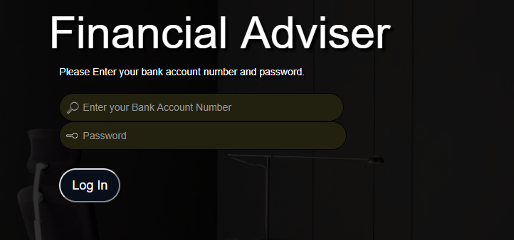
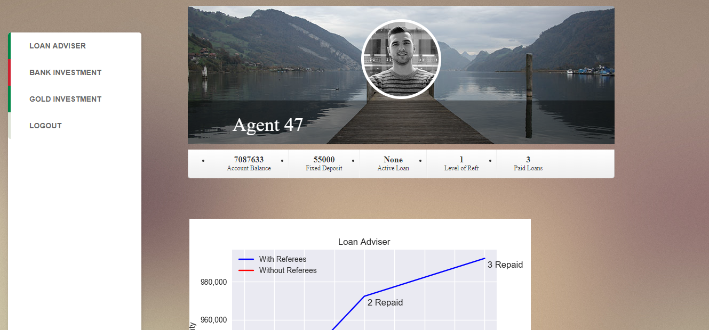
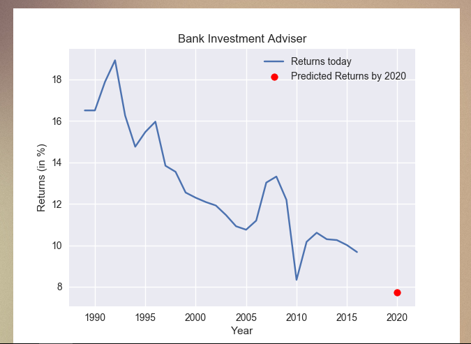

# Hackrupt-fintech-Hackathon

I, with my team built a loan advisory web app for banks which tells the amount of loan a candidate is eligible for based on his/her previous financial record with the bank.

# Example screenshots

The login page of the web app.

The Dashboard

Advisable Loan amount.
**The candidate can track** how his previous financial record with the bank and his referees makes his loan amount increase. 

This graph on a different tab shows the client what time si the best to invest in the bank to get **profitable returns.** 

